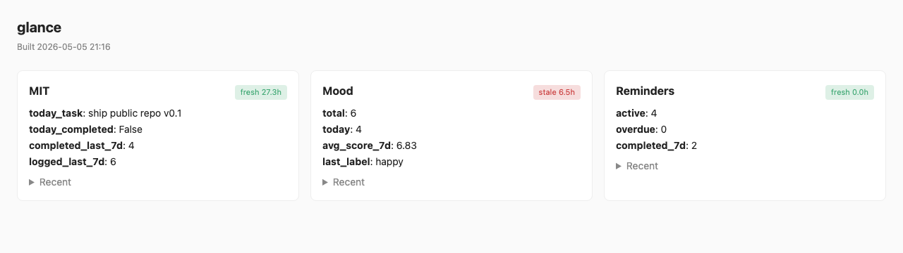

# glance

[](https://github.com/JunjieYu95/glance/actions/workflows/test.yml)
[](https://github.com/JunjieYu95/glance)
[](LICENSE)

> One openclaw skill bundle that puts everything you'd otherwise need ten
> apps for — diary, mood, reminders, daily MIT, and any tracker you want to
> invent — behind a single read-only dashboard. Logging happens in chat.
> Notifications happen via openclaw cron. Adding a new tracker is one
> command. **glance is named for the only interaction it asks of you:
> a glance.**



> _v0.1 dashboard is intentionally minimal. A richer rendering (per-day
> bar charts, mood heatmap, multi-week timelines) is tracked in
> [#1](https://github.com/JunjieYu95/glance/issues/1); the screenshot
> will be redone with realistic synthetic data once that lands._

## Why

You don't need a separate app for *track water*, *track coffee*, *log my
mood*, *remind me about X*. You need **one place** that holds them all
and a **fast way to add new ones**. The app industry replaced the old
commonplace book with ten icons on your phone, each with its own
dopamine loop. glance puts them back where they belong: in one
zero-interaction surface you only look at.

## Quickstart

```bash
git clone https://github.com/JunjieYu95/glance
cd glance
./install.sh
```

`install.sh` will:
1. `pip install -e .` — installs the `glance` CLI
2. Apply per-component SQL migrations into `~/.glance/data.db`
3. Walk you through Google OAuth (you bring your own client — see below)
4. Build the dashboard

That's it.

## Daily use, all from chat

```bash
glance diary log --title "wrapper refactor" --start 2:30pm --end 4pm
glance mood log --raw "feeling great after the run" --score 8
glance reminder add --title "renew passport" --due 2026-06-01
glance mit set --date 2026-05-04 --task "ship v0.1" --completed false
```

## Add a new tracker — one command

```bash
glance scaffold --name coffee_intake --title "Coffee" \
    --field shots:int --field origin:text \
    --cron "0 9 * * *" --notify "How much coffee today?"
```

That generates `glance/skills/coffee_intake/` with a working `log.py`
and `stats.py`, runs its migration, registers the openclaw cron, and
the next dashboard build shows a Coffee panel. **No central file edits
required.**

## What ships in the box

| Component | What it does | Cron |
|---|---|---|
| `diary_logger` | Time-tracked activities → your Google Calendar | — |
| `mood` | Hourly mood check-in via chat | hourly 8–23 |
| `reminder` | Add/complete reminders + morning digest | 08:25 daily |
| `mit` | Most Important Task nightly check-in | 23:00 daily |
| `scaffold_component` | The meta-skill — create a new tracker | — |

## Design philosophy

1. **Everything in one place.** One repo, one SQLite file, one dashboard,
   one chat surface.
2. **Read-only dashboard.** No interactive UI. Logging and queries happen
   through chat. The dashboard exists to be glanced at — never clicked.
3. **Adding a new tracker is one command.** The `scaffold_component`
   skill creates the folder, generates the skill, runs migrations,
   registers the cron, and rebuilds the dashboard from one chat
   invocation.
4. **A component is a folder.** No central registry to edit. Drop a
   folder under `skills/` with a `component.toml` and it's wired in.

## Bring your own Google OAuth client

The package never ships a shared OAuth client (avoids Google
verification and keeps the maintainer off the hook for your tokens).
You:

1. Create an OAuth Desktop client at
   [console.cloud.google.com/apis/credentials](https://console.cloud.google.com/apis/credentials)
   (enable the Calendar API in your project first).
2. Download the JSON to `~/.glance/credentials.json`.
3. Run `glance setup`.

The first run opens your browser for consent. Token is cached at
`~/.glance/token.json` and refreshed automatically.

## Reproduce the screenshot in 30 seconds

```bash
git clone https://github.com/JunjieYu95/glance
cd glance
pip install -e .
GLANCE_HOME=$PWD/examples/demo-data python examples/demo-data/seed.py
GLANCE_HOME=$PWD/examples/demo-data glance dashboard open
```

(The diary panel will show `error` because diary needs a real Calendar.
Mood, reminders, and MIT will all be populated.)

## CLI reference

```
glance setup                    First-time setup
glance doctor                   Health check
glance list                     List components
glance diary log [args]
glance mood log [args]
glance reminder {add|done|list|digest|stats} [args]
glance mit {set|today|stats} [args]
glance scaffold [args]          Create a new component
glance dashboard {build|open}
glance version
```

Pass `--help` to any subcommand for full options.

## Component contract

See [`docs/component-contract.md`](docs/component-contract.md). Every
component is just a folder with `component.toml` + `migrations/*.sql` +
`scripts/log.py` + `scripts/stats.py`. That's the entire contract.

## Contributing

See [`CONTRIBUTING.md`](CONTRIBUTING.md). Use the `scaffold_component`
skill rather than hand-writing component files.

## License

MIT — see [`LICENSE`](LICENSE).
